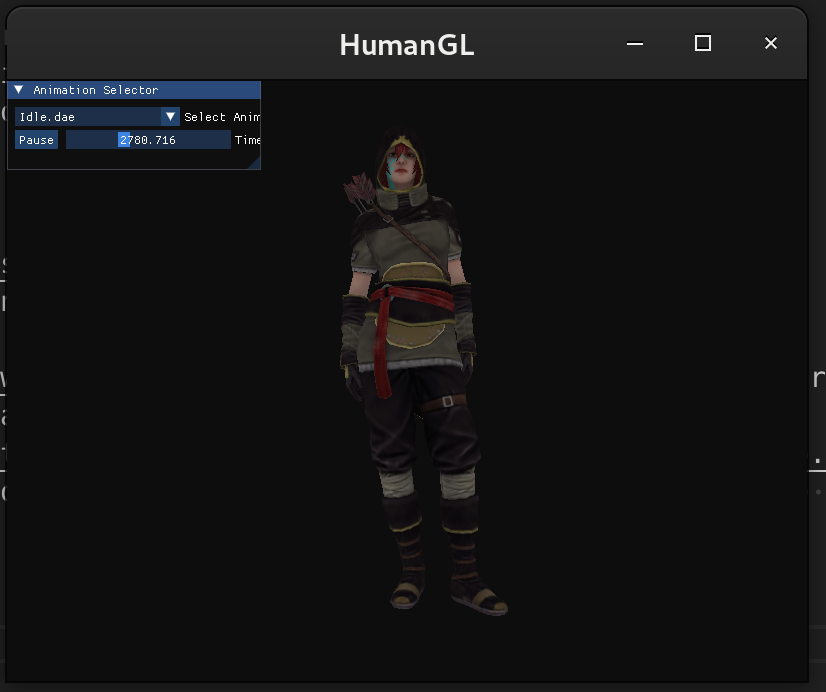
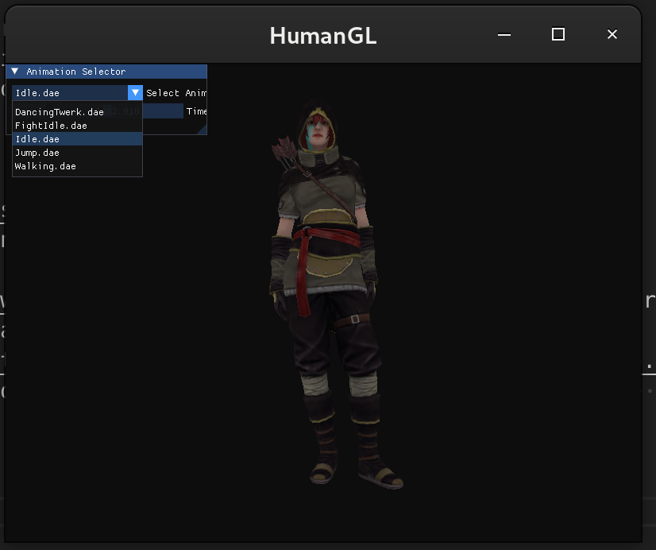
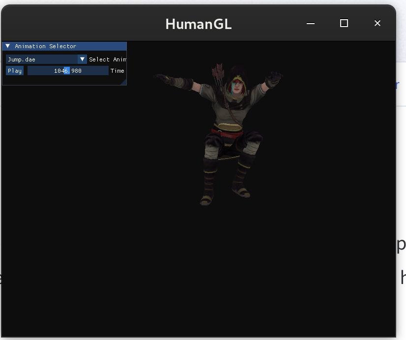
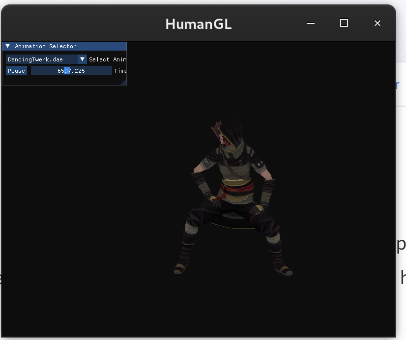

# HumanGL

## Descripción
Este proyecto es una implementación de animación esquelética utilizando **OpenGL**. Se centra en la manipulación de matrices y modelado jerárquico para animar un modelo humanoide.

## Tecnologías utilizadas
- **OpenGL** para el renderizado gráfico
- **GLEW** para la gestión de extensiones de OpenGL
- **Assimp** para la carga de modelos 3D y animaciones.
- **ImGui** para interfaz del usuario.

## Características principales
  - ✅ Sistema de animación esquelética con interpolación entre frames.
  - ✅ Implementación propia de matrices y vectores.
  - ✅ Carga de modelos 3D con Assimp (.dae).
  - ✅ Renderizado con OpenGL y shaders personalizados.
  - ✅ Interfaz gráfica con ImGui que permite: Seleccionar y pausar animaciones. Controlar el tiempo de la animación con un slider.

## Controles

- A, S, D, W, mueve la cámara.
- Girar la cámara con el ratón manteniendo pulsado el botón derecho del ratón.
-  Esc para cerrar la ventana.
  
## Requisitos

- Compilador con soporte para C++ y OpenGL 4.0.
- Bibliotecas necesarias: GLEW, Assimp, ImGui.
- Sistema operativo compatible con OpenGL.

## Guias y ayuda.

- [Learn OpenGL](https://learnopengl.com/), aquí encontrarás toda la información sobre OpenGL, que también me ha servido como guía del proyecto.
- [Mixamo](https://www.mixamo.com/), en esta página es donde se descargan los modelos 3D y animaciones
- [Assimp](https://github.com/assimp/assimp) e [Imgui](https://github.com/ocornut/imgui), los repositorios de dos de las tecnologías que he usado.

## Imagenes

